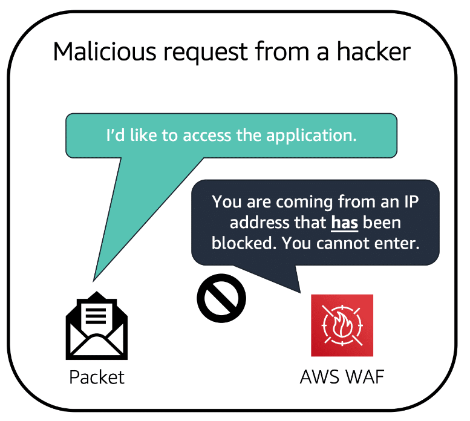
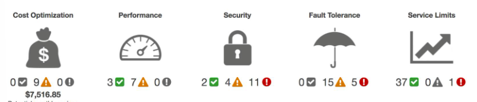

# AWS CLOUD PRACTITIONER STUDY MATERIALS
- [AWS CLOUD PRACTITIONER STUDY MATERIALS](#aws-cloud-practitioner-study-materials)
  - [1: Introduction to AWS](#1-introduction-to-aws)
    - [Introduction](#introduction)
    - [Cloud Computing](#cloud-computing)
  - [2: Compute in the Cloud](#2-compute-in-the-cloud)
    - [Introduction](#introduction-1)
    - [Amazon EC2 Instance Types](#amazon-ec2-instance-types)
    - [Amazon EC2 Pricing](#amazon-ec2-pricing)
    - [Scaling EC2](#scaling-ec2)
    - [Directing Traffic with Elastic Load Balancing](#directing-traffic-with-elastic-load-balancing)
    - [Messaging and Queueing](#messaging-and-queueing)
    - [Additional Compute Services](#additional-compute-services)
  - [3: Global Infrastructure and Reliability](#3-global-infrastructure-and-reliability)
    - [AWS Global Infrastructure](#aws-global-infrastructure)
    - [Edge Locations](#edge-locations)
    - [How to Provision AWS Resources](#how-to-provision-aws-resources)
  - [4. Networking](#4-networking)
    - [Intro](#intro)
    - [Connectivity to AWS](#connectivity-to-aws)
    - [Subnets and Network Access Control Lists](#subnets-and-network-access-control-lists)
    - [Global Networking](#global-networking)
  - [5. Storage and Databases](#5-storage-and-databases)
    - [Instance Stores and Amazon Elastic Block Store](#instance-stores-and-amazon-elastic-block-store)
    - [Simple Storage Service (Amazon S3)](#simple-storage-service-amazon-s3)
    - [Elastic File System](#elastic-file-system)
    - [Relational Database Service RDS](#relational-database-service-rds)
    - [Amazon Dynamo DB](#amazon-dynamo-db)
    - [Amazon Redshift](#amazon-redshift)
    - [Database Migration Service](#database-migration-service)
    - [Additional Database Services](#additional-database-services)
  - [6. Security](#6-security)
    - [AWS Shared Responsibility Model](#aws-shared-responsibility-model)
    - [User Permissions and Access](#user-permissions-and-access)
    - [AWS Organizations](#aws-organizations)
    - [Compliance](#compliance)
    - [Denial-of-Service Attacks](#denial-of-service-attacks)
    - [Additional Security Servcies](#additional-security-servcies)
  - [7. Monitoring and Analytics](#7-monitoring-and-analytics)
    - [Amazon CloudWatch](#amazon-cloudwatch)
    - [AWS CloudTrail](#aws-cloudtrail)
    - [AWS Trusted Advisor](#aws-trusted-advisor)
  - [8. Pricing and Support](#8-pricing-and-support)
    - [AWS Free Tier](#aws-free-tier)
    - [AWS Pricing Concepts](#aws-pricing-concepts)
    - [Billing Dashboard](#billing-dashboard)
    - [Consolidated Billing](#consolidated-billing)
    - [AWS Budgets](#aws-budgets)
    - [AWS Cost Explorer](#aws-cost-explorer)
    - [AWS Support Plans](#aws-support-plans)
    - [AWS Marketplace](#aws-marketplace)

## 1: Introduction to AWS

### Introduction

- Client-server model

- Server: Amazon Elastic Compute Cloud (Amazon EC2)
  - validates requests
  - returns repsonse

- You only pay for what you use with AWS.
  - So essentially, pay for what you need.

### Cloud Computing

- <b>Definition</b>: The on-demand delivery of IT resources over the internet with pay-as-you-go pricing.
- Undifferentiated heavy lifting of IT. Common tasks expected of all IT solutions.
  
#### Deployment models for cloud computing

- Companies have varying IT infrastructure requirements
- There are 3 cloud computing deployment models:
  - <b>Cloud-Based Deployment</b>:
    - Run all parts of the application in the cloud.
    - Migrate existing applications to the cloud.
    - Design and build new apps in the cloud.
    - New apps can be built using low-level infrastructure that a company manages on their own, or using high-level infrastructure constructed and managed by AWS.
  - <b>On-Premises Deployment</b>:
    - Maintain applications that are run on technology that is fully kept on-premises.
    - Deploy them using virtualization and resource management tools.
    - Increases resource utilization by using application management and virtulaization technologies.
  - <b>Hybrid Deployment</b>:
    - Allows the maintaining of legacy applications on-premises while still making use of the cloud-based resources.

#### Benefits of Cloud Computing
- Trade upfront expense for variable expense
- Stop spending money to run and maintain a data-center
- Stop guessing capacity because AWS offers scalabality as you need it.
- Cheaper rates because large clouds achieve higher economies of scale. 
- Speed and agility of cloud computing.
- AWS's global footprint allows you to quickly deploy globally with low latency.

------------------

## 2: Compute in the Cloud

### Introduction

- Multitenancy: Sharing underlying hardware between virtual machines.
- Hypervisor: Divides virtual machines.
- EC2 instances are unaware of eachother.
- EC2 Config:
  - Can choose OS
  - Can choose whatever software you want to run on your EC2 instance.
    - includes DBs
    - Web apps
  - Vertically scaling: Increase CPU and storage.
  - Control network accessability. 
  - Compute as a Service (CaaS).

#### Amazon Elastic Compute Cloud (Amazon EC2)

- Launch: Select a template with basic configs like those listed above. Includes specifying network security.
- Connect: Can connect in many ways via a program or app. Users can also access the instance by logging in and accessing the computer desktop.
- Use: After you connect. You can install software, add storage, and copy and organize files.

### Amazon EC2 Instance Types

- EC2 instances are like employees at a coffee shop. They all handle certain requests with a variety of tasks.
- Different types of employees -- Different types of instances
- Divided into different families with different configs of cpu, memory, and storage.
- Types
  1. ##### General purpose
    - Balance of compute, memory and networking resources.
    - Can be used for application servers, gaming servers, backend servers for enterpirse applications, or small and medium databases.
    - <b>Consider:</b> Cases where the need for computing, memory, and networking are relatively equivalent.
  2. ##### Compute optimized
    - Compute intensive tasks
    - gaming servers, high performance computing (HPC), and scientific modeling, batch processing.
    - <b>Consider:</b> Can the product benefit from high computing capabalities like batch processing workloads that need to process a lot at once.
  3. ##### Memory Optimized
   - Memory intensive tasks
   - <b>Consider:</b> Cases where large amounts of data need to be loaded into memory at once. For example, a high perfomance database that stores data in memory for quick access.
  4. ##### Accelerated computing
    - floating point number calculations, graphics processing, data pattern matching
    - Utilize hardware acceleration. Hardware accelerators expedite data processing.
  5. ##### Storage optimized
    - Storage intensive tasks
    - Examples: distributed file systems, data warehousing applications, and high-frequency online transaction processing systems
    - <b>IOPS</b> - input/output operations per second
    - <b>Consider:</b> Applications that have high IOPS requirements.

### Amazon EC2 Pricing

- Purchase Options
  1. On-Demand
   - Ideal for short-term, irregular workloads that can't be interrupted.
   - Examples: Developing/testing apps, runnings apps with unpredicatble usage patterns
  2. Savings Plans
   - Commit to an hourly rate to an instance family and Region for 1 or 3 year term.
   - So its still pay as you use (meaning you don't need to specify anything upfront) but you do commit to a rate up front.
   - Savings up to 72% compared to on-demand.
  3. Reserved Instances
   - A billing discount applied to the use of On-Demand instances in your account. 
     - Strandard Reserved Instances: Specify your instance type and size and region before buying.
     - Convertible Reserved Instances: Good if you need to change to different availability zones or instance types.
   - Reserved instances require that you state the following:
     1. Instance type and size: m5.xlarge
     2. Platform description (OS)
     3. Tenancy
   - After the term is over, you revert to On-Demand pricing until you specify to either terminate the instance or purchase a new reserved instance. 
  4. Spot Instances
     - Uses unused EC2 computing capacity but can be interrupted at any time. Basically mooching. Good for processing that is in no rush.
  5. Dedicated Hosts
     - Physical servers with Amazon EC2 instance capacity that are fully dedicated to your use. 
     - Most expensive.

### Scaling EC2

How capacity can grow and shrink based on business needs. Want a full system with no single point of failure.

#### Scalability:

- Involves beginning with only the resources you need and designing your architecture to automatically respond to changing demand by scaling out or in. 
- The <b>Amazon EC2 Auto Scaling</b> enabled you to automatically add or removes instances in repsonse to changing application demand.
- Two approaches:
  - <i>Dynamic Scaling</i> responds to changing demand.
  - <i>Predictive Scaling</i> automatically schedules the right number of instances based on predicted demand.
- Decoupled system allows for exactly the right amount of power for each instance type.
  - Like if you only needed 3 coffee makers but 8 order takers.
- Can set a minimum capacity, desired capacity, and a max capacity.

### Directing Traffic with Elastic Load Balancing

Need to organze the workload evenly among the instances. Need a host. Called a <b>Load Balancer</b>

<b>Elastic Load Balancing</b>:

- Regional construct, so it is readily available with no added cost.
- ELB also acts as a middle man between different tiers (instance types).
- When an instance is ready, it tells the ELB. When an instance is terminating, it tells the ELB.

### Messaging and Queueing

Like an order board. Queues orders to the barista so they don't have to vbe perfectly in sync. (Five white boys but theyre not insync)

**Loosely-coupled architecture** : Applications failure does not cascade.

- Amazon Simple Queue Service (SQS):
  - Send
  - Store
  - Receive
  - Messages between software components at any volume.
  - Order board is SQS queue
  - Data contained within a message is called a **Payload**
- Amazon Simple Notification Service
  - Used to send out messages and notifications.
  - Notifications are publish/subscribe modal.
  - Can fan out notifications to users and instances.

#### Monolithic Applications vs Microservices

Monolithic Apps are composed of multiple tightly-coupled components.

Microservices approach allows for loosely coupled components. In AWS, the microservice approach is achieved using two services to achieve application integrationg: Amazon SNS, and Amazon SQS.

### Additional Compute Services

- **Serverless:** You cannot see or access the underlying infrastructure.
  - Gives you more time to worry about new products and developments rather than maintaining servers.
  - **AWS Lambda:** Put code into a lambda function and set up a trigger to know when to use that function. 
    1. Upload Code to Lambda.
    2. Set Code to trigger from an event source.
    3. Code runs only when triggered.
    4. Pay only for the compute time you use. 
    - Processes under 15 minutes.
- **Amazon Elastic Container Service (ECS) and Amazon Elastic Kubernetes Service (EKS).**
  - Container orchestration tools:
    - Created to help you manage your containers.
  - Container: A package for you code including dependencies and configs.
  - ECS designed to run containerized apps at scale. Supports Docker.
  - EKS does similar thing but with different tooling and features.
- **AWS Fargate** manages your containerized apps for you.

## 3: Global Infrastructure and Reliability

Need high availability and fault tolerance. AWS operates in many different areas called **Regions**

### AWS Global Infrastructure

- Choose which region you want to run out of
  - Regions are closed ecosystems.
- Business Factors for choosing a Region
  1. Compliance: Could be legal
  2. Proximity: How close can you get to your customer base.
     - **Latency** is a big factor
  3. Feature availabilty: Some regions do not have full availability of all features of AWS. Always changing.
  4. Pricing: Some regions are more costly to run out of than others. This can due to laws. Each region has a different price sheet. 

- Each **Availability Zone** or Zed is one or more discrete data centers with redundant everything.
- EC2 instances launch a virtual machine on a physical hardware that is intalled in an availability zone
- **Each AWS Region consists of multiple isolated Availability Zones**
- They aren't built right next to eachother in case of disaster.
- Referring back to AWS Scaling. When maintaining multiple instances of the same type (to account for failure) they are run from different availability zones within the Region. 

### Edge Locations

- **CDN**: Content Delivery Network

- **Amazon Cloud Front**: Amazon CDN
  - Uses "edge locations". 
  - Push content from a region to edge locations to speed up responses.
- **AWS Outposts**: Install a AWS Region within your own data center.

### How to Provision AWS Resources

- In AWS everything is an API.

#### AWS Management Console

- Web based interface for accessing and managing AWS services
- Can be used on mobile to monitor resources, view alarms, and access billing info.

#### AWS CLI

- Make AWS API calls in the AWS command line interface

#### Software Development Kits

- AWS SDKs allow you to make API calls for your desired programming language.
- Supported languages include: C++, Java, .NET, and more. (Probably JS)

#### AWS Elastic Beanstalk

- Provide code and config settings and Elastic Beanstalk deploys the resources necessary to perform:
  - Adjust capacity
  - Load balancing
  - Automatic scaling
  - Application health monitoring

#### AWS CloudFormation

- Allows you to define resources declaritively using JSON or YAML. 
- Lets you define what you want.
- Supports many AWS services.
1. Create **CloudFormation Template**
2. CloudFormation parses the tmplate and provision the resources you defined
3. CloudFormation manages all API calls for you. 

## 4. Networking

### Intro

#### Amazon Virtual Private Cloud

Creates isolated section in cloud.

- Can be public-facing
- Or private, with no internet access
- Called subnets
- Cashier would be in public subnet
- Barista in private subnet

### Connectivity to AWS

- **VPC** is used to establish boundaries around your AWS resources.
  - Allows you to provision an isolated section of AWS cloud where you can launch resources in a virtual network.

#### Internet gateway
- Allows public traffic from the internet into your VPC

#### Virtual Private Gateway
- To access private resources in a VPC, use a **Virtual PRivate Gateway**
- Allows protected interent traffic to enter the VPC.
- "Protected" Internet Traffic is traffic encrpyted using a VPN

#### AWS Direct Connect

- Allows for a direct and private connection between a data center and VPC.
- Helps reduce network costs and increase the amount of bandwidth that is available for other requests to travel through your network.

### Subnets and Network Access Control Lists

#### Subnets

A private section of a VPC in which you can group resources based on security or operational needs. Can be public or private
- **Public Subnets** Contain resources that need to be accessed by the public
- **Private Subnets** Contain resources that should only be accessible through your private network, such as a database that contains personal info
- Subnets can communicate with eachother. Part of the decoupled system.

#### Netwrok Traffic in a VPC

- A **Packet** is a unit of data sent over the internet or a network
- Netwrok traffic enters into a VPC through an internet gateway.
- Before a packet enters into a subnet it must be checked for permissions.

#### Network Access Control List (ACL)

Controls inbound and outbound traffic at a subnet level.
- The default Network ACL allows all in/out traffic into subnets.

#### Stateless Packet Filtering

- Remember nothing
- abide by a list.
- Checks list to enter and exit
- Network ACL's are stateless

#### Security Groups

- Virtual firewall that controls inbound and outbound traffic for an EC2 instance
- Default: Allows all outbound, denies all inbound.
- If multiple instances in a VPC, they can either share a security group or have their own.

#### Stateful Packet Filtering

- Security Groups are stateful.
- They remember previous decisions made for incoming packets.
- Remembers responses from requests they sent.

### Global Networking

#### Domain Name System (DNS)

The phone book of the internet.

- Client connects to DNS resolver looking for a domain
- Resolver asks company DNS server for IP Address
- The company DNS server responds with the IP.
  
#### Amazon Route 53

- Gives a reliable way to route end users to internet applications hosted in AWS
- Also allows you to manage all of your domain names in one place.

## 5. Storage and Databases

### Instance Stores and Amazon Elastic Block Store

#### Instance Stores

- **Block-level storage** volumes behave like physcial hard drives.

An instance store provides temporary block-level storage to an instance.
- This storage is from the drives attached to the host computer of the instance.
- Has the lifespan of the instance. 

- **Amazon Elastic Block Store (EBS)** is a service that provides block-level stoarge volumes for instances that aren't terminated with the instance.
- Created by defining the config and provisioning it.

#### Amazon EBS snapshots

- **EBS snapshots** are incremental backups
1. First backup: copies all data.
2. Subsequent backups: only updated or added blocks are saved. 

### Simple Storage Service (Amazon S3)

#### Object storage

- in **Object storage** each object consists of data, metadata, and a key
- When a file in object storage is modified, the entire object is updated.

#### Amazon Simple Storage Service

- **Amazon S3** is a service that provides object-level storage. 
- objects in buckets.
- Maximum file size (a file being considered the data in an object) is 5 TB
- Can change access permissions as well as view versions from previous backups.

#### Amazon S3 storage classes

- offers a range of storage classes to fit business and cost needs
- Consider these things when picking
  1. How often you plan to retrieve your data
  2. How available you need your data to be

- **S3 Standard**
  - Designed for frequently accessed data
  - Stores data in a min of 3 availability zones.
  - Has higher cost than other storage classes that are geared towards infrequently accessed data

- **S3 Standard-Infrequent Access**
  - Similar to strandard byut with a lower storage price and higher retrieval price.

- **S3 One Zone-Infrequent Access**
  - One availability zone
  - low storage price
  - Good if:
    - You want to save costs
    - You can easily reproduce your data

- **S3 Intelligent-Tiering**
  - Ideal for data with unknown or changing access patterns
  - Requires a small monthly monitoring and automation fee per object
  - Moves objects between the two standard tiers based on access patterns

- **S3 Glacier Instant Retrieval**
  - Work well for archived data that requires immediate access.

- **S3 Glacier Flexible Retrieval**
  - Low cost storage for archiving data
  - can take a minute to 12 hours to recieve date depending on your needs

- **S3 Glcaier Deep Archive**
  - Lowest cost object storage class
  - able to retrieve within 12 hours

- **S3 Outposts**
  - Allows for S3 buckets to be created on premises at an AWS Outpost
  

#### Comparison Between EBS and S3

- if using cpomplete objects or only occasional changes S3 is best
- if doing complex changes on a single object. Use EBS

### Elastic File System

#### File Storage

- in file storage, multiple clients can access data that is stored in shared file folders.
- Block level storage with a local file system to organize files.

#### EBS vs EFS

- EBS stores data in a single availability zone, in that zone is only place it can be accessed.
- EFS stores data accross multiple availability zones so that it can be accessed anywhere.

### Relational Database Service RDS

- Enables you to use relational databases in AWS
- automates tasks such as hardware provisioning, database setup, patching, and backups. 
- Offers encryption at rest (encrypted while it is being stored) and encryption in transit

#### Amazon Aurora

- enterprise-class RDB
- 5x faster than standard MySQL dbs and 3x faster than standard PostgreSQL dbs.
- Helps reduce database costs by reducing unnecessary I/O operations.

### Amazon Dynamo DB

- **Non-Relational DBS** are databases that don't form relations between objects. Also called NoSQL

#### Dynamo DB

- key-value database service
- VERY FAST
- Serverless (don't have to provision anything!)
- Auto-scales up and down!

### Amazon Redshift

- Data warehouses: Big data analytics. 
  - Used when you are looking to the past.

- Redshift: Can run queries on LARGE quantities of data. 
- Used for BUSINESS INTELLIGENCE (BI)

### Database Migration Service

- Allows you to migrate a database from one place to another while remaining operational.
- Allows you to test applications data against production data, combine databases, and replicate data in real time.

### Additional Database Services

- DocumentDB:
  - document db service supports MongoDB
- Neptune:
  - Graph database
  - Used for highly connected data sets:
    - recommendation engines
    - fraud detection
    - knowledge graohs
- Quantum Ledger Databse:
  - ledger database service
  - review complete history of all changes that been made to your application data.
- Managed Blockchain:
  - create and manage blockchain networks with open-source frameworks.
  - Blockchain is distributed ledger system. (Like bitcoin)
- ElastiCache:
  - Adds cache layer on top of db to increase read times of common 
  requests
- DynamoDB Accelorator
  - Addes in-memory cache to DynamoDB

## 6. Security

### AWS Shared Responsibility Model

- Security of AWS environment is in part the responsibility of AWS and part responsibility of the the customer.
- Customer resposibilities: "security in the cloud"
- AWS responsibilities: "security of the cloud"

### User Permissions and Access

#### AWS Identity and Access Management (IAM)

- enables you to manage access to AWS services securely
- IAM features allow you to configure access based on you companies needs

#### AWS Account Root User

- owner of the coffee shop
- Best to **not** use your root user for everyday tasks
  - instead, create your first IAM user and assign it the ability to create other users.
- only use the root user for tasks that **require** the root user, such as changing that user's credentials and changing your AWS support plan.

#### IAM users

- An identity you create in AWS.
- Represents a person or application (such as a script) that interacts with AWS services and resources. 
- By default, has no permissions.

#### IAM policies

- document that allows or denies permissions to AWS services and resources.
- Enable you to customize users' levels of access to resources. 
- Best practice is to follow the principle of **least privilege** when granting permissions.
- IAM policies are attached to users.

#### IAM groups

- A collection of IAM users.
- Used to grant and deny privileges to users with similar roles.

#### IAM roles

- Grants or denies permissions
- ideal for situations in which access to services or resources needs to be granted temporarily.

#### Multi-factor authentication

- IAM has MFA.

### AWS Organizations

- Used when your company has multiple AWS accounts linked to it
- When an organization is created it creates a **root**. 
  - Parent container for all accounts

#### Organizational Units

- Helps to isolate workloads or applications that have specific security requirements.
- Attach policies to the OU

### Compliance

#### AWS Artifact

- An audit or inspection can help ensure that your company uphold regulatory standards.
- AWS Artificat is a service that provides on0demand access to AWS security and compliance reports and select online agreements.

**AWS Artificat Agreements**
- In AWS Artifact Agreements, you can review, accept, and manage agreements for an individual account and for all your accounts in AWS Organizations. 
**AWS Artifact Reports**
- provides compliance reports from third party auditors
- helps organizations/teams know they are staying within regulation.

#### Customer Compliance Center

- contains resources to help you learn more about AWS compliance

### Denial-of-Service Attacks

- attackers attempt to deny others from a service.
- Distributed DoS (DDoS) involves using myltiple sources to overwhelm the server.

#### AWS Shield

- Protects Againsts DDoS

**Standard**
- Uses various analysis techniques to detect malicious traffic in real time
**Advanced**
- Provides detailed diagnostics as well 

### Additional Security Servcies

#### AWS Key Management Service (AWS KMS)

- can choose the specific levels of access control the you need for your keys.
- Example: You can specify which users or groups have access to certain keys. Or you can disable a key that no one uses.

#### AWS WAF

- Web application firewall
- Works with Amazon CloudFront and an Application Load Balancer.
- Uses a web access control list (ACL) to protect resources.
  - This ACL is stateful. Though it always works with a permission list.

#### Amazon Inspector

- performs automated security tests
- Provides a detailed list ordered by severity of security issues
- SHARED RESPONSIBILITY MODEL this tool doesn't guaruntee security.

#### Amazon GuardDuty

- Inspects network and account activity for security findings.
- Can find detailed findings about threats detected in the AWS Management Console.

## 7. Monitoring and Analytics

### Amazon CloudWatch

- A web service that enables you to monitor and manage various metrics and configure alarm actions based on data from those metrics
- Metrics are used to represent data points for your resources. 
- Cloud watch plots metrics graphically with respect to time.

#### CloudWatch alarms

- create alarms that automatically perform actions if the value of a metric goes above or below a threshold.

#### CloudWatch Dashboard 

### AWS CloudTrail

- Makes a record of all API calls and all necessary data from them to monitor them.
- Typically updated 15 minutes after event occurrence

#### CloudTrail Insights

- Within CloudTrail, you can enable insights
- Allows CloudTrail to auytomatically detect unusal API activities.

### AWS Trusted Advisor

- web service that inspects your AWS environment and provides recommendations based on AWS best practices
- "Trusted Advisor compares its findings to AWS best practices in five categories: cost optimization, performance, security, fault tolerance, and service limits."
  
#### AWS Trusted Advisor dashboard

## 8. Pricing and Support

### AWS Free Tier

3 options for using AWS for free

1. Always Free
   - Each service has a limit on what can be used for free per month
   - For example, AWS Lambda allows 1 million free requests and up to 3.2 million seconds of compute time per month. Amazon DynamoDB allows 25 GB of free storage per month.
2. 12 Months Free
   - free for first 12 months of initial sign-up
   - Examples include specific amounts of Amazon S3 Standard Storage, thresholds for monthly hours of Amazon EC2 compute time, and amounts of Amazon CloudFront data transfer out.
3. Free trials
   - offers for services that are fixed length terms that begin when you start using the service
   - For example, Amazon Inspector offers a 90-day free trial. Amazon Lightsail (a service that enables you to run virtual private servers) offers 750 free hours of usage over a 30-day period.

### AWS Pricing Concepts

#### How AWS Pricing Works

There are 3 categories
1. Pay for what you use. No contracts
2. Pay less money when you reserve the services prior.
3. Buy in bulk for cheaper rates.

#### AWS Pricing Calculator

- Lets you explore pricing options.
- Can organize pricings into groups with the goal of organizing pricing how you organize your company and it's financials.

### Billing Dashboard

- Compare your current month-to-date balance with the previous month, and get a forecast of the next month based on current usage.
- View month-to-date spend by service.
- View Free Tier usage by service.
- Access Cost Explorer and create budgets.
- Purchase and manage Savings Plans.
- Publish AWS Cost and Usage Reports(opens in a new tab).

### Consolidated Billing

- Allows you to conjoin all bills from all accounts in an organization.
- This is Consolidated Billing
- The bill is given to the root user of the org.
- Billing is aggeregated so that you get full use of any savings plans and reserved instances.
  
### AWS Budgets

- Allows you to set limits on how much you are willing to spend 
- sends an alert when near or exceeding a budget.
- Updates every 3 days.

### AWS Cost Explorer

- Graphicly displays cost usage.

### AWS Support Plans

#### Basic Support

- free
- includes:
  - whitepapers
  - documentation
  - support communities
  - can also contact AWS for billing
  - Limited # of trusted advisor checks
  - AWS Personal Health Dashboard

#### Better Support

- each have the same benefits as Basic Support plus the ability to open up infinite technical support cases
- Pay by month pricing
- in ascending order of pricing
  1. Developer Support
      - Best practice guidance
      - client-side diagnostic tools
      - building-block architecture support, consisting of guidance for how to use AWS services together.
  2. Business Support
      - Use-case guidance
      - All AWS Trusted Advisor checks
      - Limited support for third-party software
  3. Enterprise On-Ramp
      - it just keeps getting better
  4. Enterprise
      - and better

#### Technical Account Manager (TAM)

- Available for both Enterprise and Enterprise On-Ramp
- Basically a homie that provides proper guidance on how to use AWS services best

### AWS Marketplace

- digital catalog of thousands of software listings from independent software vendors
- Use it to find, test, and buy software that runs on AWS.
- Can explore solutions by industry and use case.

